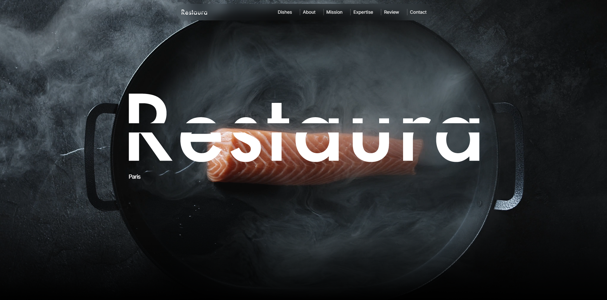

# 📚 Landing Page - Estudos

Este projeto é uma **landing page voltada para meios de estudo**, desenvolvida com foco em **responsividade, performance e experiência do usuário**.  
Utilizando tecnologias modernas do ecossistema front-end, o site traz uma interface limpa, intuitiva e com animações suaves.

---

## 🚀 Tecnologias utilizadas

- **TypeScript** – Tipagem estática para maior segurança e clareza no código  
- **React** – Biblioteca para construção da interface  
- **TailwindCSS** – Estilização rápida, responsiva e moderna  
- **Framer Motion** – Animações fluidas e performáticas  

---

## 📌 Funcionalidades

- 100% responsivo (desktop, tablet e mobile)  
- Menu mobile funcional  
- Animações modernas com Framer Motion  
- Código totalmente tipado em TypeScript  
- Uso dos recursos mais atuais do front-end  

---

## 📷 Preview



---

## 📂 Como executar o projeto

Clone o repositório:

```bash
git clone https://github.com/seu-usuario/nome-do-repo.git
